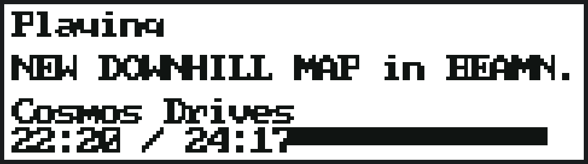
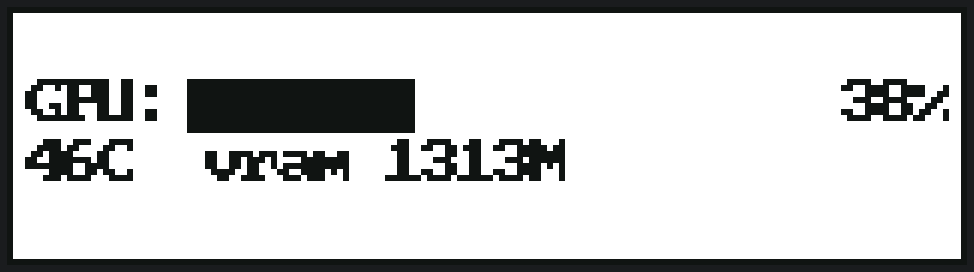
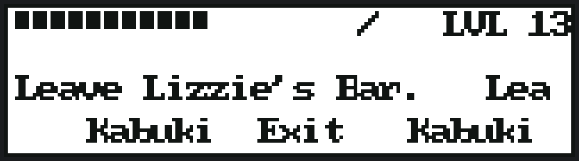
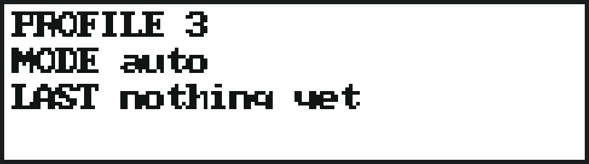
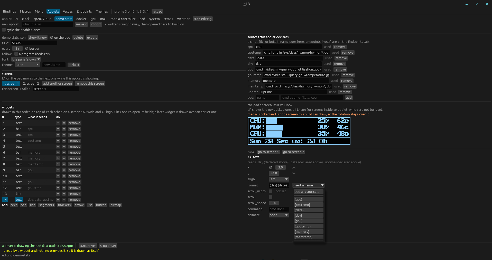
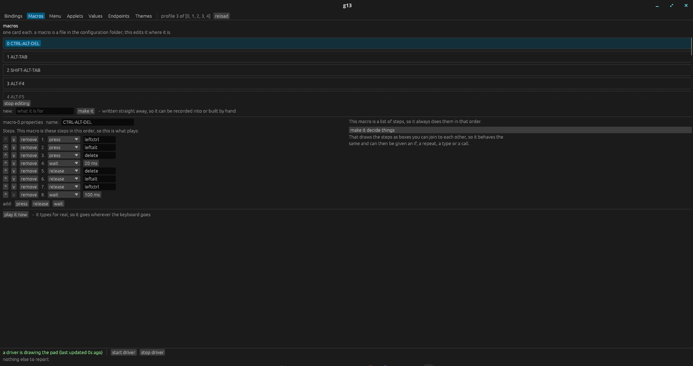
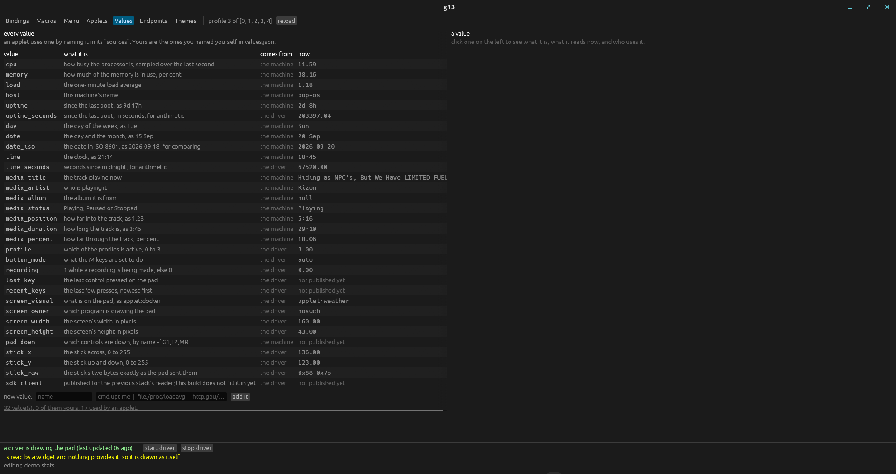
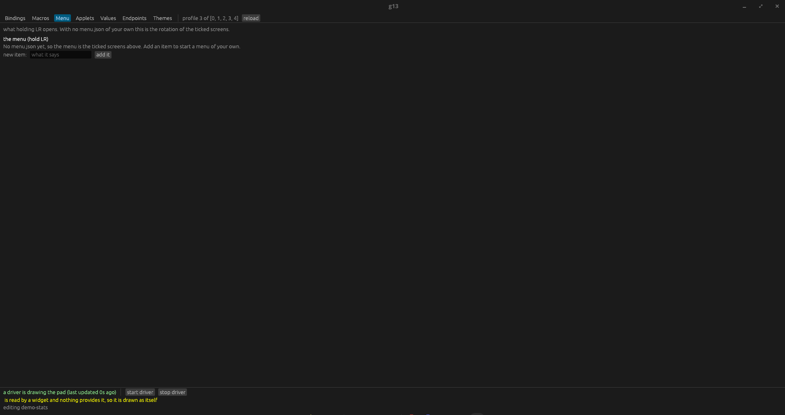
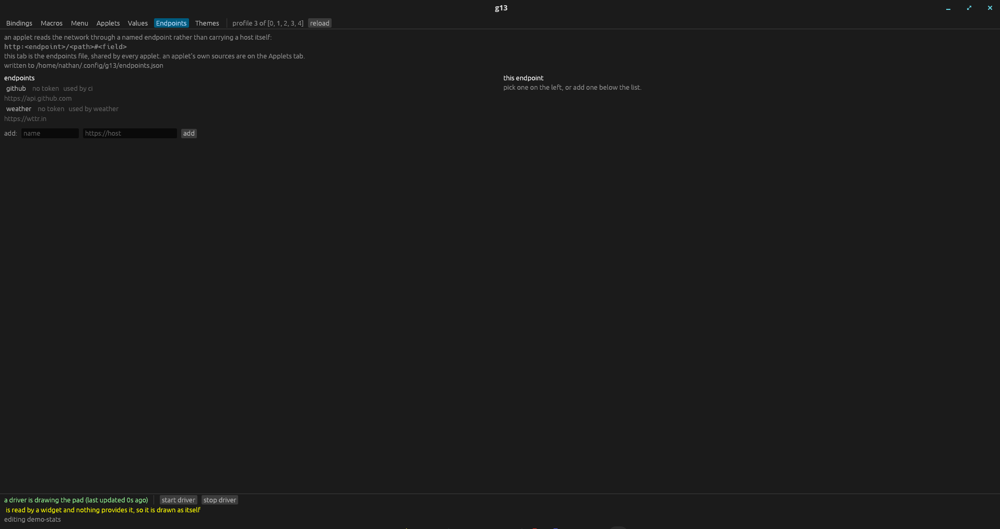
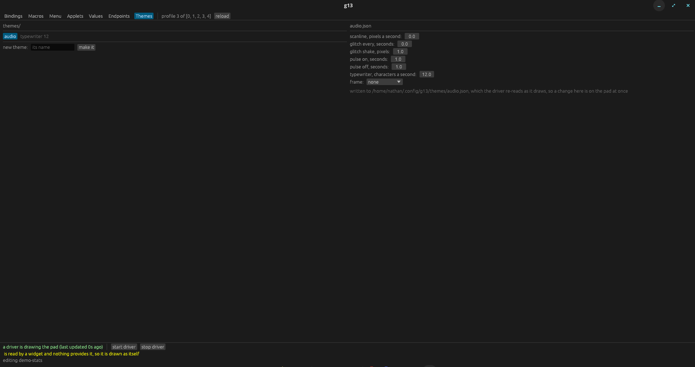

# G13  -  one language, one binary

Drivers, screen and applets for the Logitech G13 gameboard, written from scratch in Rust.

**Status: in use.** This is the driver the pad runs on, and the window it is configured with. The GPL-2 stack it
replaces is [`npc-nathan/linux-g13-driver`](https://github.com/npc-nathan/linux-g13-driver), and it stays
installable alongside: the two agree about the configuration they read, so either can drive the pad.

**The manual is in [`docs/`](docs/README.md)**  -  start with
[getting started](docs/getting-started.md) if you are new to it.

## What it is

One `g13` binary, nothing to install beyond the kernel and the device:

```
g13 run                 the driver: reads the pad, sends the bound keys, draws the screen
g13 gui                 the configuration window

g13 bind C KEY          set what a control sends
g13 bindings            show what each control currently sends
g13 profile [N]         show the active profile, or switch to N
g13 record C            press a control, then the key, mouse or gamepad button it should send
g13 colour [R,G,B]      the screen's backlight

g13 watch               read the pad and print which bits change
g13 watch --map         walk the pad's controls to establish which bit each one sets
g13 lcd [--visual V]    what is on the pad, or set it
g13 doctor              check the install: device, permissions, config, services

g13 applet list         the applets installed
g13 applet preview NAME draw it as text, and print the values it resolved
g13 applet check NAME   what gave nothing, and what would be drawn over what

g13 values              what the running driver is doing
g13 values --catalogue  every value this build publishes, and what each means

g13 macro list          every macro, and whether it decides anything
g13 macro show ID       what it does, step by step or box by box
g13 macro play ID [--as C]  play it now, as if control C fired it

g13 version             the version this binary is
```

## What it looks like

**The pad.** A 160x43 screen, twenty-two G keys, a thumbstick, and a driver that makes all of it work:


**On its screen.** The screen is **160x43 pixels in one bit**. These are the real screens  -  drawn by the same code
the driver draws with (`g13 lcd --visual`, `g13 applet preview`)  -  so a picture here cannot drift from what the
pad shows. The backlight colour is a profile setting (`color=R,G,B`); these are white so the detail is legible.

|  |  |
|---|---|
|  |  |
| **clock**  -  the time, the date and the day | **media**  -  what is playing, and how far in |
|  |  |
| **weather**  -  an applet, with its own bitmap for the sky | **gpu**  -  an applet reading the machine |
|  |  |
| **a game's own HUD**  -  Cyberpunk 2077, through the mod in [g13-hud](https://github.com/npc-nathan/logitech-g13-hud) | **the pad's own state**  -  the profile, the stick's mode, the last control |

The rest of the set  -  `system`, `temps`, `docker`, `media-controller`, `demo-stats`  -  is in
[`docs/images/`](docs/images/).

**In the window.** `g13 gui` edits the same files the driver reads, and a change lands within a second. One design
across every tab: a list on the left, the selected thing on the right.

|  |  |
|---|---|
|  |  |
| **Bindings**  -  what each control sends, and the stick's settings beside it | **Applets**  -  a screen's widgets, the inspector, and the field grid |
|  |  |
| **Macros**  -  a macro's graph, node by node | **Values**  -  the machine's values, and what each one means |
|  |  |
| **Menu**  -  the pad's own menu, level by level | **Endpoints**  -  the endpoints file every applet shares |
|  |  |
| **Themes**  -  themes as files, and the editor for one |  |

**In a terminal.** The command line is not a fallback: everything the window does is done here too, and the two
write the same files.

```console
$ g13 applet list
applets in ~/.config/g13/applets:
  ci               2 widget(s), 3 source(s), every 5s
  clock            3 widget(s), 4 source(s), every 1s
  cp2077-hud       6 widget(s), 7 source(s), every 0.2s
  demo-stats       14 widget(s), 9 source(s), every 1s, 2 screens
  docker           3 widget(s), 3 source(s), every 2s
  gpu              4 widget(s), 3 source(s), every 1s
  mail             2 widget(s), 2 source(s), every 5s
```

## What it will not be

It will not read your existing setup any differently. `~/.config/g13/` keeps its formats, applets keep their
schema, and source kinds keep their names (`http:`, `file:`, `json:`, `cmd:`, `regex:`, `env:`, …). A file this
build cannot parse is reported rather than half-loaded, and it never rewrites a file into something else.

## Licence

MIT OR Apache-2.0  -  see [LICENSE-MIT](LICENSE-MIT) and [LICENSE-APACHE](LICENSE-APACHE). This is a clean-room
rewrite written from observed behaviour and public protocol documentation, not a translation of the GPL-2 project
it replaces; see [PROVENANCE.md](PROVENANCE.md).
