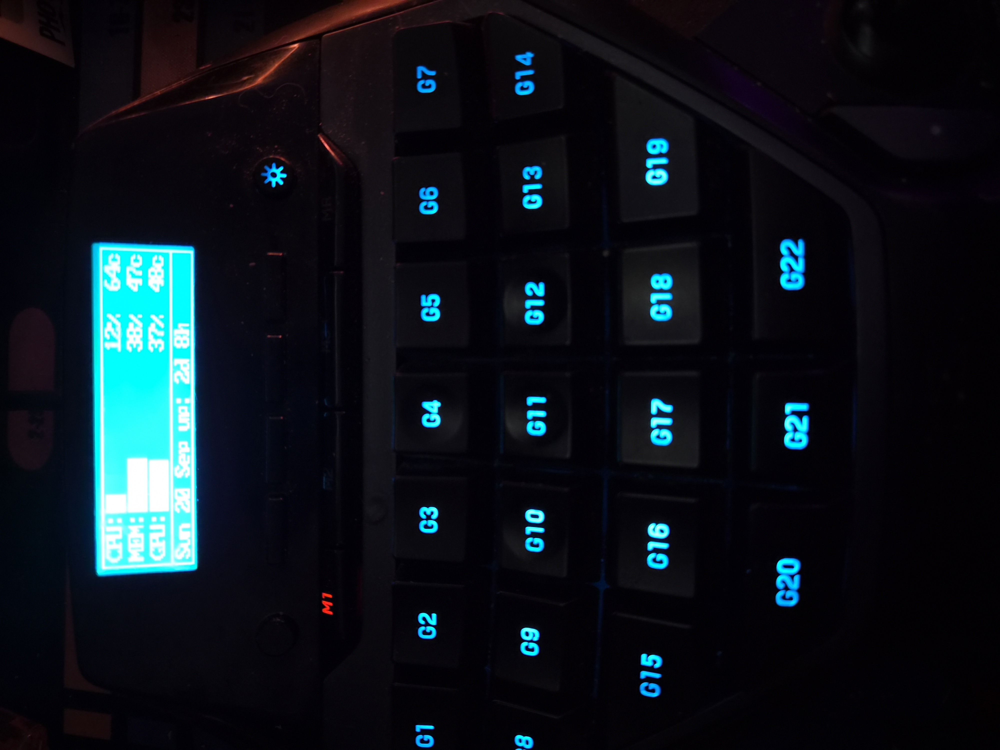

# G13  -  the documentation

This is the manual for the Rust driver in this repository. It is written for the person at the desk: every
section says what to click or what to type, and every command in it exists and runs.

**New here?** Read [installing.md](installing.md) if `g13` is not on your machine yet, then [getting-started.md](getting-started.md). That one is in order, from "is it installed" to
"something is on the pad's screen".



*The pad this is for: a 160x43 screen, twenty-two G keys, four L keys, three M keys, a thumbstick, and one wheel.*

## The documents

| document | what it covers |
|---|---|
| [installing.md](installing.md) | where the binary comes from: the package, the tarball, from source, and taking it away again |
| [using-the-pad.md](using-the-pad.md) | using it: the controls and where they are, what the keys do, profiles, the screen, recording, the stick, the lights |
| [getting-started.md](getting-started.md) | first run: check the install, start the driver, start the window, set a binding, see something on the screen |
| [the-window.md](the-window.md) | `g13 gui`, tab by tab, every field and button |
| [macros.md](macros.md) | recording a macro on the pad, the node graph, the Macros tab, the file format, the terminal commands |
| [bindings.md](bindings.md) | the pad's controls, what a control can be bound to, profiles, the stick, the screen colour and the four lights |
| [applets-and-sources.md](applets-and-sources.md) | applets, the widgets they are made of, and every kind of source, including endpoints |

The Cyberpunk 2077 half is a separate project and lives in its own repository: [g13-hud](https://github.com/npc-nathan/logitech-g13-hud) is the Cyber Engine Tweaks mod that writes the game's numbers out, and its pad screen is in [logitech-g13-applets](https://github.com/npc-nathan/logitech-g13-applets).
| [troubleshooting.md](troubleshooting.md) | `g13 doctor`, and the failures that actually happen, by symptom |

## How the pieces fit

There are two programmes and they do different jobs:

- **`g13 run` is the driver.** It takes the pad, reads it, sends the keys your bindings name, and draws on the
  pad's screen. It must be running for the pad to work at all.
- **`g13 gui` is the window.** It edits your configuration files. It does not touch the pad. Everything you
  change in it is written immediately, and a running driver picks it up within a second.

So: the window is where you set things up, the driver is what makes them happen.

> **The pad only exists to the computer while a driver holds it.** It is not a plain keyboard; nothing will see
> it, not even the kernel's own listing of input devices, unless something claims it. So "the pad has stopped
> working" nearly always means "no driver is running"  -  not "the pad is broken".

## What runs on the input loop, and what does not

The pad is the one thing that has to be read promptly, so `g13 run` keeps its input loop to reading the pad and
publishing the values. Everything else is on another thread:

| on the input loop | on another thread |
|---|---|
| reading the pad (packets, presses, the stick) | drawing the screen, and running an applet's sources |
| applying bindings, sending keys, macros | **writing a frame to the panel** |
| publishing `g13-values.json` | gathering the machine's numbers (`playerctl`, `/proc`) |

The frame write is the one worth naming: **one frame costs about 26 milliseconds** on this device (measured; about
38 a second at best), so a write on the input loop would be 26ms during which a press is not being read. The
screen thread writes it instead, and the input loop never does  -  there is a test that fails if one is ever put
back there.

## Where things live

| path | what it is |
|---|---|
| `~/.config/g13/` | your configuration: bindings, macros, applets, endpoints |
| `~/.config/g13/bindings-N.properties` | what each control does in profile N |
| `~/.config/g13/macro-<id>.properties` | a macro's steps (the flat form) |
| `~/.config/g13/macro-<id>.nodes.json` | a macro's graph, when it decides something |
| `~/.config/g13/applets/` | your applets, one JSON file each |
| `~/.config/g13/endpoints.json` | the URLs and tokens your applets and macros may use |
| `~/.config/g13/visuals.json` | which screens are enabled, and which is showing |
| `~/.config/g13/stick.json` | the stick's calibration and mode |
| `$XDG_RUNTIME_DIR/g13-state-<user>.json` | what the running driver is doing  -  what `g13 values` and the window read |
| `$XDG_RUNTIME_DIR/g13-values.json` | the values the driver publishes for applets and macros to read, in the same keys the previous stack used |

## Running it

The driver, in a terminal, so you can read what it says:

```bash
g13 run
```

The window, in another terminal:

```bash
g13 gui
```

Either can be started in any order. `g13 doctor` tells you whether everything needed is actually in place, and
what to do about anything that is not  -  see [troubleshooting.md](troubleshooting.md).

## Conventions in these documents

- **`C`** means a control on the pad, named as the pad names it: `G1`-`G22`, `L1`-`L4`, `M1`, `M2`, `M3`, `MR`,
  `LR`, `LMB`, `RMB`, `JCLICK`, `UP`, `DOWN`, `LEFT`, `RIGHT`, `JUP`…
- **A command** is shown as you would type it: `g13 bind G1 a`.
- **A file line** is shown as it appears in the file, e.g. `G1=p,k.30`.
- Anything in *italics* is an explanation of why, and can be skipped.
