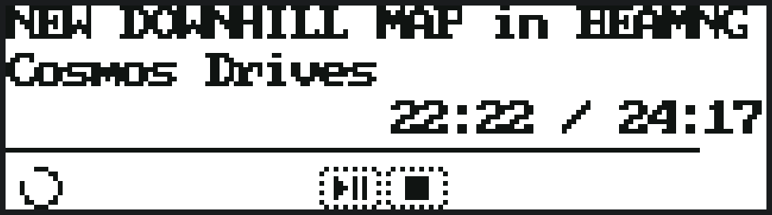
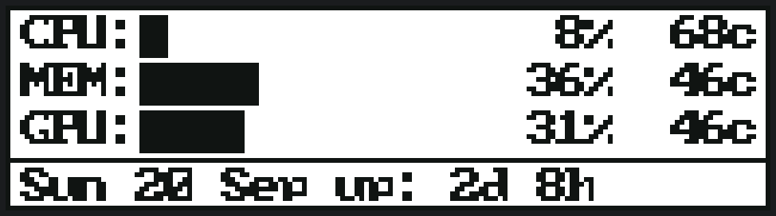

# Applets and sources

An **applet** is a screen of your own: a file in `~/.config/g13/applets/` that says what to read and what to
draw. One applet is one screen, 160 pixels wide and 43 high.

```json
{
  "name": "temps",
  "title": "temperatures",
  "interval": 2,
  "border": true,
  "sources": {
    "cpu": "cmd:sensors | awk '/Package/ {print $4}'",
    "gpu": "file:/sys/class/hwmon/hwmon5/temp1_input"
  },
  "widgets": [
    {"type": "text", "x": 4, "y": 4, "format": "cpu {cpu}"},
    {"type": "bar",  "x": 4, "y": 16, "w": 100, "h": 6, "source": "cpu", "max": 100}
  ]
}
```

- **name** is the file's name and how the screen is referred to: `applet:temps`.
- **title** is what the Screen tab shows.
- **interval** is how often its sources are read, in seconds. Sources cost something every time they are read  - 
  a `cmd:` starts a process  -  so this is the dial for that.
- **border** draws a one-pixel frame.
- **sources** is what the widgets can read by name. See [Sources](#sources) below.
- **widgets** are drawn in order, on top of each other.

Edit it in the window (**Applets** tab) or in a text editor; the window writes the file's own JSON, so keys this
build does not act on are kept rather than dropped.

## Widgets

| type | what it draws | its fields |
|---|---|---|
| `text` | a line of text, or one that runs through a width | `x`, `y`, `align` (`left`, `centre`, `right`), `format`, `scroll_width`, `scroll`, `scroll_speed` |
| `bar` | a filled bar, for a value out of a maximum | `x`, `y`, `w`, `h`, `source`, `max` |
| `line` | a horizontal rule | `x`, `y`, `w` |
| `segments` | a bar made of blocks, like a level meter | `x`, `y`, `w`, `h`, `count`, `source`, `max` |
| `brackets` | the two uprights of a box, for framing text | `x`, `y`, `h`, `len`, `thick` |
| `arrow` | a small direction mark, for a compass or a wind direction | `x`, `y`, `r` (the radius), `source` |
| `list` | the items of a source, one per line, with the chosen one marked | `x`, `y`, `w`, `rows`, `source` |
| `button` | a box with a label in it  -  what a screen of buttons is made of | `x`, `y`, `w`, `h`, `format` |
| `bitmap` | a named picture, drawn where it says | `x`, `y`, `name` |

**Text longer than its `scroll_width` is cut off, unless `scroll` is ticked**  -  then it runs through the width
instead, at `scroll_speed` **pixels a second** (30 unless you say otherwise, between 1 and 200). **The number you
write is the number it runs at.** A frame cannot move part of a pixel, and a screen with a running text on it is
drawn twenty times a second, so a speed that is not a whole number of pixels a frame steps unevenly: fifteen a
second is three quarters of a pixel a frame, which shows as three frames of movement and one still, every four, and
that reads as a slight pulse. **The speeds that run evenly are the multiples of twenty** (20, 40, 60 …), and
everything in between runs at the speed asked for with that pulse. The drawing honours the file exactly  -  it does not
quietly round what you wrote. The string and a
gap walk past each other, so the end of a title arrives rather than never appearing at all, and it is stopped at
the width it was given rather than drawing across what is beside it. A still picture (the window's preview,
`g13 applet preview`) shows the start of it, because there is no clock to run it with.

**A screen with a scroll on it is drawn twenty times a second**, not once: its *readings* are still taken once
per the applet's `interval`  -  a source may be a `cmd:` that costs a tenth of a second  -  while the drawing runs at
the pad's own rate. Nothing has to be configured for this; the driver looks at what the screen holds. The same
rule is what makes `stick_x` and `stick_y` follow your hand: those two are re-read for every frame because they
are the values that move with the pad, where `cpu` and what is playing are read once per interval like everything
else.

The running text is moved by the machine's own clock, not by a value: the `time` a source can read is `14:27`,
hours and minutes, and a picture built from that stands still for a minute and then jumps.

A `text` widget with **no `x`** is anchored by its `align`: centred means the middle of the screen, right means
the last column inside the border. That is how a right-aligned readout is written without knowing its own width.

The character cell is **6 pixels wide and 7 high**, and a glyph is 6×7  -  measured off the device, not guessed. So
a line of 25 characters is 150 pixels and fits; 27 does not.

**One colour.** The panel is on or off per pixel, so everything drawn is the same ink; two things on the same
pixel do not blend, the later one wins. `g13 applet check <name>` reports a widget that would be drawn *over*
another one, because that is a screen where something silently disappears.

A screen made of them, on the pad:


## What a widget writes in its format

A format string is text with `{name}` in it, where `name` is a source:

```
"cpu {cpu}%   mem {memory}%   {media_title}"
```

The value can be shaped:

| you write | you get |
|---|---|
| `{cpu}` | the value as it is  -  `63.5` |
| `{cpu:.0}` | rounded to whole numbers  -  `64` |
| `{cpu:.1}` | one decimal place |
| `{cpu:>3}` | right-aligned in three characters  -  ` 64`, so numbers below ten do not jitter the line |
| `{cpu:<3}` | left-aligned in three characters |

## Themes: what an applet looks like when it moves

A theme is a **file**: `themes/<name>.json`, beside the `applets` folder. An applet says `"theme": "cyberpunk-2077"`
and every widget follows it; with no theme an applet behaves exactly as it did before themes existed. Nothing is
built in  -  a theme you write and drop in appears in the window's dropdown, and the window's `make it` writes a new
one with every effect visible so you have something to change.

The panel is 160x43 in **one bit**, so a theme cannot be a palette. It is motion, rhythm and shape:

| in a theme | what it does |
|---|---|
| `"scanline": 60` | a one-pixel line sweeping down the screen at 60 pixels a second. `{"speed": 40}` is the same thing |
| `"glitch": {"every": 6, "shake": 1}` | every six seconds the whole picture slips a pixel for one frame |
| `"pulse": {"on": 0.5, "off": 0.5}` | the rhythm the widgets that blink share. `"pulse": 2` is one number for the whole cycle |
| `"typewriter": 12` | how fast a widget that types itself reveals its words, in characters a second |
| `"frame": "single"` | how widgets are boxed: `none`, `single` (a box with a pixel of margin) or `brackets` (four corner brackets, for a heads-up display look) |

Two of those are *screen-wide* (the scanline and the glitch) and two are *per widget*, so a theme says what the
rhythm is and a widget says whether it is part of it. Any widget may carry one word for that:

```json
{"type": "text", "x": 0, "y": 30, "format": "CPU HOT", "animate": "blink"}
```

`"animate": "blink"` (or `"pulse"`, `"flash"`) draws the widget only during the lit half of the theme's pulse  - 
in one bit a blink is ink appearing and disappearing. `"animate": "typewriter"` reveals the text a character at a
time. A widget that scrolls is the `text` widget's own `scroll` and `scroll_width`, because it needs the width.

**A screen with anything moving on it is drawn twenty times a second**, whether that is a scroll, a blink, a
typewriter, a scanline or a glitch  -  and its *readings* are still taken once per the applet's `interval`, because
a source may be a command that costs a tenth of a second. Nothing to configure: the driver looks at what the
screen holds and at what your theme asks for.

A theme that will not read is **said**, on the applet that names it, rather than left to look like a theme that
works and is subtle.

## A widget can change the screen

A widget's `command` runs a shell command with `cmd:`, and it can also **change which screen of its applet is
showing** with `screen:`:

```json
{"type": "button", "x": 0, "y": 30, "w": 60, "h": 9, "format": "PLAYLIST", "command": "screen:playlist"}
```

The target is the screen's **number** (counted from one, as the window and the menu count them: `screen:2`) or its
**title** (`screen:playlist`), which is the one that survives moving screens about. A number nobody has, or a title
no screen carries, is refused **with the list of screens** rather than landing somewhere unexpected. `screen:` only
means a screen of the applet that is showing; from another applet it says so.

**A widget may do more than one thing**, so `command` can be a list, run in order:

```json
{"type": "list", "x": 0, "y": 0, "w": 120, "h": 30, "source": "tracks",
 "command": ["cmd:playerctl play {screen_item}", "screen:playing"]}
```

One action written plainly is still a plain string, so every applet written before lists existed is unchanged. The
screen part is decided on the driver's own loop, because that is where the showing screen is decided; everything else
runs off the loop like a macro.

**A value that goes into a command is quoted, and arrives as one argument.** A command is run by a shell, and a value
is whatever the thing you named answered with - a line of a file, a field of an endpoint's reply, a track's title.
Written in bare, a value holding `;`, a backtick or `$(...)` would be shell syntax rather than a value, and a list
whose rows come from the network would be running what it read. So the value is quoted and everything else in the
command is passed through exactly as written, an `awk` body's own braces and quotes included. A command that puts its
own quotes around a value should leave them off, or they arrive as part of the value.

**The whole playlist idea, then:** a `PLAYLIST` button carrying `"command": "screen:playlist"` and an alert that shows
it only when a playlist can be detected, on a second screen a `list` of tracks whose `command` plays the track you are
on and returns to the playing screen. Walk to the button with L2/L3, press L4, choose a track with L2/L3, press L4.

## Alerts: a widget that reacts

A widget may carry a question and something to do while the answer is yes:

```json
{"type": "text", "x": 0, "y": 30, "format": "CPU HOT",
 "alert": {"when": {"value": "cpu", "op": ">", "to": 80}, "look": "flash"}}
```

**`when` is a macro condition**  -  the same JSON a macro's `if` node holds, read by the same parser and answered by
the same evaluator, because there is one way to ask "when is this true" in this program. It may name the values the
applet declares, and the active profile; a question about a control is always false here, because that is the one
thing only a pad can answer:

| the question | what it asks |
|---|---|
| `{"value": "cpu", "op": ">", "to": 80}` | a reading compares with a number: `==`, `!=`, `<`, `<=`, `>`, `>=`, `contains` |
| `{"value": "title", "op": "contains", "text": "playing"}` | or with a string |
| `{"profile": 2}` | whether that profile is in force |
| `{"all": [...]}` / `{"any": [...]}` / `{"not": {...}}` | every one, any one, not this |

### Asking about the time or the date

The clock and the date are readings like any other, and they compare in the units they are written in rather than
character by character - so `"10:54"` does not come before `"6:00"` the way it would as plain text:

| what you ask | what it means |
|---|---|
| `{"value": "time", "op": ">", "text": "19:00"}` | after seven in the evening |
| `{"value": "time", "op": "<=", "text": "6:00"}` | up to six in the morning - zero-padding does not matter |
| `{"value": "date_iso", "op": ">=", "text": "2026-09-01"}` | on or after the first of September |

**`time`** is `10:58` and **`date_iso`** is `2026-09-18`. Both are ISO 8601, which is what anything else reading them
expects.

**A window that crosses midnight is `any`, not `all`.** Nothing is both before six in the morning and after seven at
night, so `all` of those two is never true:

```json
{"any": [
  {"value": "time", "op": "<=", "text": "6:00"},
  {"value": "time", "op": ">", "text": "19:00"}
]}
```

**`date`** is the screen's own form, `18 Sep`, and it is deliberately **not** orderable: it carries no year, so "is
31 December after 1 January" has no answer from it. Ask `date_iso` about dates, and let `date` be what the screen
says - `{"value": "date", "op": "contains", "text": "Sep"}` works, `{"value": "date", "op": ">", ...}` never will.

**`time_seconds`** is the same clock as a number of seconds since midnight, for arithmetic: `{"value":
"time_seconds", "op": ">", "to": 68400}` is the same question as after seven in the evening.

**`look`** is what happens while it is true:

| look | what it does |
|---|---|
| `flash` | the widget is drawn in the lit half of a fast, fixed flash and not in the dark half. Fast and fixed on purpose: an alarm should not be slow because a theme is calm |
| `invert` | the widget's own drawing is turned inside out where it stands  -  a filled box with its words punched out |
| `show` | the named `bitmap` is drawn where the widget is, so `"bitmap": "warning"` puts a picture there |
| `border` | a frame round the widget, flashing with the alarm |

**A widget an alert is hiding is not something the pad can be on.** The walk the keys move along  -  the widgets with a
command, in drawing order  -  leaves out any widget whose `show` question is false, so the border and the keys always
agree with what is drawn. A button that only appears when there is a playlist, for instance, is not selectable when
there is no playlist.

A value nobody has published is **unknown**, not zero, so an alert about a reading that is not there does not fire.
A key an alert does not take  -  anything but `when` and `look`  -  is **said** in the applet's problems rather than
ignored, so a file left from when `show` named a picture does not quietly do nothing.

An alert whose condition will not read, or whose `show` names a picture nothing defines, is **said** in the applet's
problems rather than left looking like an alert that works. A screen with an alert on it counts as moving, so it is
drawn at the pad's rate while one can fire.

## Animated bitmaps

A `bitmap` widget names a picture, and a picture may have **more than one frame**  -  a walk cycle, a spinner, a
cursor:

```json
"walk": {"w": 8, "h": 8, "ms": 120, "frames": [
  {"rows": ["..####..", ".######."]},
  {"rows": ["..####..", "#######."]}
]}
```

A bitmap with **no `frames`** is one frame, exactly as before, and `rows` alone still works  -  nothing already drawn
changes. `ms` is how long each frame is held (120 by default, 20 to 10000). The frame is chosen by the machine's
clock, so the same moment always draws the same frame and a sprite cannot run at a speed that depends on how often
the screen happened to be drawn.

The `bitmap` widget is unchanged: it is placed with `x` and `y` like any other. A screen with a multi-frame bitmap
on it counts as **moving**, so it is drawn twenty times a second  -  which is also why an animation **animates in the
window's preview** without anything extra being written for it. The pad's own limit applies: twenty drawings a
second is the most any sprite can be.

An animation is drawn in the window's own bitmap editor: a frame strip (`1 2 3`, `+ frame`, `remove frame`), `ms a
frame`, and the pixels below belong to the frame you are on. A new frame starts as a copy of the one before it,
because a sprite is usually a change to the last one. Saving writes `frames` for an animation and `rows` for a
still picture, so a picture that was not animated stays written exactly as it was.

## Sources

A source is written as **`<kind>:<what to read>#<where in it>`**, and the last part is optional. A source with no
kind at all is a name out of the values catalogue  -  `"cpu"` means the same as `"built-in:cpu"`.

| kind | what it reads | example |
|---|---|---|
| *(none)* or `built-in:` | a value this build publishes (the **Values** tab lists them all) | `cpu`, `built-in:memory` |
| `env:` | an environment variable | `env:USER` |
| `file:` | the contents of a file, trimmed | `file:/proc/uptime` |
| `json:` | a file of JSON, then a dotted path inside it | `json:/tmp/stats.json#gpu.temp` |
| `regex:` | a file, then the first match of a pattern in it | `regex:/proc/meminfo#MemAvailable:\s+(\d+)` |
| `cmd:` | what a command prints (through `sh -c`, so pipes and `awk` work) | `cmd:sensors \| awk '/Package/ {print $4}'` |
| `http:` | an endpoint, then a field inside what it returns | `http:home/temp#value.value` |
| `mqtt:`, `ws:`, `imap:` | **not implemented**  -  they are refused with a reason rather than attempted |  -  |

Rules that apply to all of them:

- **A source that will not read is `Missing`, and `Missing` is not zero.** A bar with no reading draws empty, a
  macro's comparison against it is false, and `g13 applet check` names it. Unknown is not a number.
- **A command has a deadline** (by default 400 ms) so a source that hangs cannot freeze the screen.
- **A name that is not in the catalogue is an error**, not a blank: `cpuu` says what the real names are.

### Buttons: acting on what is on the screen

**Any widget can carry a `command`.** The widgets that have one are the things the pad's own keys move
through, in the order the screen draws them:

| key | what it does |
|---|---|
| **L2** | the previous one, wrapping |
| **L3** | the next one, wrapping |
| **L4** | runs the chosen one's command |

The chosen widget is drawn **with a border around it**, so you can see where you are without reading a number.
Nothing carries a command and those four keys keep whatever the profile's file binds them to  -  the binding
system never quietly takes them.

An audio applet, which is the shape this was built for  -  four buttons and a reading, no list anywhere:

```json
{
  "name": "audio",
  "interval": 2,
  "sources": {},
  "widgets": [
    {"type": "button", "x": 4, "y": 2,  "w": 80, "h": 9, "format": "Start/Pause", "command": "cmd:playerctl play-pause"},
    {"type": "button", "x": 4, "y": 13, "w": 80, "h": 9, "format": "Previous",    "command": "cmd:playerctl previous"},
    {"type": "text",   "x": 4, "y": 24, "format": "{media_title}"},
    {"type": "button", "x": 4, "y": 30, "w": 80, "h": 9, "format": "Next",        "command": "cmd:playerctl next"},
    {"type": "button", "x": 4, "y": 41, "w": 80, "h": 9, "format": "Stop",        "command": "cmd:playerctl stop"}
  ]
}
```

Press **L3** and the border moves Start/Pause → Previous → Next → Stop → Start/Pause. Press **L4** on Next and
`playerctl next` runs.

* A **`command`** is an ordinary source  -  `cmd:`, `file:`, `json:`, `http:`, an endpoint, or a built-in name  - 
  and it runs *off the pad's own loop*, like a macro, so a command that takes its time cannot stall a keypress.
  What it has to say, including a failure with the command named, comes back to the driver's log.
* **`{screen_item}`** and **`{screen_selected}`** are the chosen thing: the row's text and its number counted
  from 1. They are filled the way a widget's `format` is filled  -  one resolver for names  -  and both are
  published, so `g13 values` shows what is selected.
* A **list** widget with a command is walked by its **rows** instead of as a whole: L2/L3 move down the items
  and `{screen_item}` is the row you are on, so a command like `cmd:docker restart {screen_item}` acts on the
  container you can see. A list whose rows have not been read yet has nothing to be on, so it is skipped.
* One list per screen is walked  -  its rows  -  and any other list is drawn but not walked.



### More than one screen in one applet

An applet can hold several screens. Each has its own title and its own widgets; the sources stay the applet's,
because a screen is a view of the same readings rather than a different set of them.

```json
{
  "name": "docker",
  "interval": 3,
  "sources": {"running": "cmd:docker ps -q | wc -l"},
  "screens": [
    {"title": "containers", "widgets": [{"type": "text", "x": 2, "y": 2, "format": "running {running}"}]},
    {"title": "images", "widgets": [{"type": "text", "x": 2, "y": 2, "format": "images"}]}
  ]
}
```

* **While an applet with more than one screen is showing, L1 moves to its next screen.** That is the applet's own
  control, not a binding: nothing has to be set up for it, and outside that case L1 keeps whatever the profile's
  file binds it to.
* The screen number belongs to the screen you are looking at. Switch away and back and you start at the first
  one; a number chosen in a three-screen applet means nothing in a two-screen one, so it is wrapped rather than
  trusted.
* **An applet with no `screens` is one screen** made of its `widgets`, exactly as before this existed. Nothing
  needs rewriting.
* `screens` and top-level `widgets` in the same file is ambiguous: the screens are what is drawn, the top-level
  widgets are ignored, and `g13 applet check` says so.
* In the window, the **Applets** tab has a `screens` row: click one to edit it, `add a screen` to give the applet
  a second (your widgets move into screen 1, so nothing is lost), `remove this screen` to take one away. A screen
  has a name of its own - the box beside the row - and it is what the pad's menu shows for that applet.

`g13 applet preview NAME --selected 2` draws the border the pad would put on the second thing the screen can act
on, so the highlighted look can be checked without holding the pad. `g13 applet preview NAME --screen 2` draws
the second screen without the pad (screens are numbered from 1, the
way the window and the pad's menu number them, and `--screen` left out means the first), `g13 lcd --visual
applet:NAME --screen 2` puts one on the pad itself, and `g13 applet check NAME` draws every screen rather than
only the first.



### An applet a program feeds: `follow`

Some applets are written from outside  -  a game, a script, anything that can write a file. The applet says so:

```json
"follow": {"seconds": 20, "profile": "Cyberpunk"}
```

While the file behind one of its own sources is **being written**, that applet is what is on the pad; and if it names
a binding set, that set is the one in force. When the writing stops, the screen and the profile both go back to what
they were.

It is not a process check. "The program is running" is read as **"the file behind this applet is being written"**  - 
which is the same thing, works the same through Wine, and needs nothing taught to it about any particular game.

| in the file | what it does |
| --- | --- |
| `"follow": true` | the default window: twenty seconds |
| `"follow": 5` | five seconds |
| `"follow": {"seconds": 5, "profile": "Cyberpunk"}` | five seconds, and switch to that **binding set**  -  by the name it has in `profiles.json` |
| no `follow`, or `false` | the applet is only ever shown because somebody chose it |

`seconds` is **how long it keeps the screen after the last write**, so a pause in a game does not flicker the screen
away. Only `file:` and `json:` sources can be "being written"  -  a `cmd:` or an `http:` source is never what makes an
applet live, because there is no file to watch.

Choosing something else while it is live is **respected**: this saves a button press, it does not fight you. It
starts following again the next time the program runs. And the pad does not *come up* on a screen whose program is
not running  -  start the driver after a game was closed and it shows something that does not depend on it, rather
than stale numbers from the last session.

**Who owns the screen can be read from the terminal.** `g13 screen` prints the owner: the driver's own name, or a
program that has claimed it. `g13 screen auto` gives it back, and `g13 screen <name>` records a program's claim. It
is kept in `~/.config/g13/screen-owner`, and the driver publishes it as the value `screen_owner`, so an applet or a
macro can read who has it. **The driver does not act on it yet** - it draws its own visuals whatever the file says,
so a claim is recorded rather than obeyed. What takes the screen today is the `follow` rule above.


### Pictures: bitmaps, and there is only one way to draw one

An icon *is* a bitmap. There is no glyph set beside it, because two ways to draw the same thing is two ways to
keep in step.

* **`~/.config/g13/bitmaps.json`**  -  the shared set every applet may use.
* **`~/.config/g13/applets/<name>.bitmaps.json`**  -  that applet's own, and it **wins by name**.
  The applet `audio` has a *sidecar* file `audio.bitmaps.json`. A sidecar is not an applet: it is not offered in
  the Applets tab, and it is not offered to the pad's rotation as a screen. It is edited by drawing it, in the
  `bitmap` widget's inspector.

```json
{"play": {"rows": ["..##..", ".####.", "######", "######", ".####.", "..##.."]},
 "stop": {"rows": ["####", "####", "####", "####"]}}
```

`rows` is one string per pixel row, `#` lit and any other character not. `w` and `h` are worked out from the rows
unless you say them; a bitmap whose rows disagree with its size is refused by name rather than drawn wrong.

```json
{"type": "bitmap", "x": 6, "y": 4, "name": "play", "command": "cmd:playerctl play-pause"}
```

A `bitmap` widget draws the named picture, and  -  like any widget  -  a `command` makes it something the pad's L4
runs and L2/L3 land on. A name nothing defines is reported with the two file names to put it in, rather than
drawn as nothing; a bitmap that will not parse is reported the same way, so it cannot look like a picture nobody
wrote.

## Endpoints

An `http:` source never carries a host or a token. It names an **endpoint**, and the endpoint is defined once, in
`~/.config/g13/endpoints.json`, shared by every applet:

```json
{
  "home":  {"url": "http://127.0.0.1:8080", "timeout": 3},
  "weather": {"url": "https://wttr.in", "insecure": true},
  "github": {"url": "https://api.github.com", "token": "…"}
}
```

**Two things are bounded for you.** A reply is read up to **10 MB**, and anything larger is reported as a problem
rather than truncated - so a source that fails with *could not read the reply* on a big document is saying the document
is bigger than that. And while a redirect is followed (up to ten of them), **the token is not sent on to where it
points**: the credential goes to the endpoint you named and nowhere else.

**A token belongs on a link that can keep it.** A token on an `http://` endpoint, or on one whose certificate check
is switched off, is a credential sent where somebody on the way can read it: the window says so on that endpoint's own
row, and `g13 doctor` reports it under `endpoint tokens`. Nothing refuses it - an `http://` host on your own network is
a real setup - but it is said rather than left to be discovered later.

- **url** is the base. `http:home/temp#value` reads `http://127.0.0.1:8080/temp`.
- **token** is sent as a bearer token. It is never written into an applet, and the window shows it masked.
- **insecure** turns off the certificate check, for endpoints whose certificate is known to be broken.
- **timeout** is in seconds.

The window's **Endpoints** tab edits this file, and shows which applets need each endpoint  -  read from the
applets themselves, so it cannot go stale.

## The values catalogue

The names this build publishes by itself  -  `cpu`, `memory`, `uptime`, `day`, `date`, `time`, `host`, the media
keys, the profile, the stick  -  are the catalogue. It is a documented list, not a fallback: `g13 values
--catalogue` prints every entry and what it means, and the window's **Values** tab shows the same thing with its
current reading beside it.

That is what makes `{cpu}` work with no source of your own, and it is also what a macro's question can name.


## Checking one

```bash
g13 applet list                # what is installed
g13 applet preview temps       # draw it as text, and print the values it resolved
g13 applet check temps         # what gave nothing, and what would be drawn over something else
```

`preview` needs no driver and no pad: it reads the sources and prints the screen as characters, so an applet can
be written at a desk.

## Values of your own

A source spec lives inside each applet's `sources`, so the same command typed into five applets is five copies that
drift. `~/.config/g13/values.json` names one instead:

```json
{
  "where": "cmd:echo upstairs",
  "cpu_temp": "cmd:sensors | grep 'Package id 0' | awk '{print $4}'",
  "gpu_load": "http:gpu/load#value"
}
```

The spec is written in **exactly the same language** an applet's `sources` use - `cmd:`, `file:`, `http:<endpoint>/<path>#<field>`, `json:`,
or a published name - so there is one language and one resolver for the whole system. To use one, an applet points its
own source at the name:

```json
{"name": "place", "sources": {"spot": "where"},
 "widgets": [{"type": "text", "x": 0, "y": 0, "format": "{spot}"}]}
```

**In the window:** the **Values** tab lists every value, with yours marked as **you**, and the **used by** column
reads out of the applet files - so a value nothing uses says so. Type a name and a spec in the **new value:** row
under the list and press **add it**; it is written straight away.

**Two refusals, both said rather than done quietly:**

* **a name this build already publishes** - `cpu`, `time`, `media_title` - cannot be yours, because every applet
  already reads those and taking one would change the meaning of applets you did not touch;
* **a name you already have** is not written over either.

A `values.json` that will not read, or a spec that will not resolve, is **said** with the reason, naming what there
is - including the values you named yourself.

## What the font can actually draw

The panel's font is **128 glyphs of ASCII** - a bitmap, one column of bytes per character. Text that comes from
outside is not ASCII: a browser writes a video's title with the typographic apostrophe, *"EVERYONE’S Car!"*, and no
ASCII font has a glyph for U+2019.

Those characters are **folded to the shape the font has**, on the way in, so every widget benefits and nothing has to
know about it:

| comes in | drawn as |
|---|---|
| `’` `‘` `‛` `´` `′` (U+2019, U+2018, U+201B, U+00B4, U+2032) | `'` |
| `“` `”` `„` `″` | `"` |
| `–` `—` `―` `−` | `-` |
| `…` | `.` |
| `•` `·` `∙` | `*` |
| a non-breaking or thin space | a space |
| `×` | `x` |
| `é` `è` `ê` `ë` | `e` |

**Greek and Cyrillic are drawn properly**, not folded: **56 Greek glyphs** and **130 Cyrillic ones** are in the font,
so `Ω`, `Σ`, `Ж`, `Я` and their lower-case forms appear as themselves. Both came from **public-domain** sources and
were converted from rows to columns; the Provenance file records which, and how they were checked.

Their *shapes* are the ones the Linux console uses, which is why Cyrillic `А` and Latin `A` are drawn a little
differently - the Cyrillic one has its crossbar low. That is correct, not a bug.

**Known:** the Cyrillic source's letters are twelve rows tall and this font has eight, so the descenders of `Д`, `Ц`
and `Щ` are trimmed. Legible, not exact.

**A line takes the height of the tallest font it actually used.** Text in the panel's own font is eight rows as it
has always been; a line containing a 12-row character is twelve rows, and everything below it moves down. Nothing is
clipped - the character the writer asked for is the one drawn. A list of Chinese rows is therefore taller per row than
a list of Latin ones, which is the honest cost of it.

**Several scripts can share one line.** The drawing resolves each character against a stack of fonts - the first one
that has a glyph draws it - and measures it with *that* font's advance, so a Japanese title inside an English applet
lays out correctly rather than being restricted to one script per screen. Today the stack holds one font; the mechanism
is what a second one plugs into.

**Anything else draws as a small box**  -  which is the font saying *something was here* rather than nothing. That box
used to be **eight columns of ink against an advance of six**, so an unknown character drew over the two characters
beside it; it now fits its own cell, which is the difference between a box and a smear.

## Wearing a font

An applet names one in its file, exactly as it names a theme:

```json
{"name": "rune-wall", "font": "runes", "widgets": [{"type": "text", "x": 0, "y": 0, "format": "ᚠ ᚢ ᚦ"}]}
```

**Every font in `fonts/` is a fallback for every screen**, whether the applet names one or not. That is the point for a
value like `media_title`, which is arbitrary text from outside: a Japanese song title in an English applet, or a
Cyrillic name, or a rune  -  the applet did not name a font for it and could not.

The named font is put **in front of the panel's own**, so a character it lacks  -  a Latin letter in a rune font, a
digit anywhere  -  is still drawn rather than boxed. That is the same stack that lets one line hold several scripts.

**A name with no font behind it is said** on the applet, and the panel's own font is used, so a screen with a typo in
its font name looks as it did before rather than blank.

## Fonts of your own

`~/.config/g13/fonts/<name>.json` is a font. Put one there and a screen can wear it, the way a screen wears a theme;
nothing needs rebuilding.

```json
{
  "name": "runes",
  "advance": 6,
  "line_height": 8,
  "glyph_rows": 7,
  "font": null,
  "from": "drawn here 2026-09-18, from the Unicode chart",
  "glyphs": {
    "ᚠ": ["..#...", ".#....", "#.....", "###...", "#.....", ".#....", "..#..."],
    "ᚢ": ["#...#.", "#...#.", "#...#.", "#...#.", "#...#.", ".#.#..", "..#..."]
  }
}
```

* **`advance`**  -  how far the cursor moves after a character, in pixels. Six is the panel's own font.
* **`line_height`**  -  how far apart lines are placed.
* **`glyph_rows`**  -  how many rows of ink each glyph has, and every glyph must have exactly that many. **A glyph
  may use all eight rows of its cell**, and the bottom ones are where descenders live: the imported Cyrillic `Д`, `ц`
  and `щ` keep their feet and tails there, and the panel font declaring seven rows was quietly cutting them off.
* **`glyphs`**  -  one entry per character. **Letters are written the way every other picture in this project is
  written**: strings of rows, `#` for ink and anything else for blank. A character outside the table draws as a small
  box rather than vanishing.
* **`from`**  -  where the glyphs came from, so a font carries its own provenance the way `PROVENANCE.md` does for the
  code. Worth filling in for anything not drawn by hand.

**A file that will not read is said, never skipped**: a glyph with the wrong number of rows is reported with the count
it has and the count the font declares, and the rest of the folder still loads.

## Checking every applet at once

```bash
g13 applet check <name>   # one applet: what it reads, what answers, and where ink would collide
g13 applet check --all    # every applet, with a count, and an exit code that fails if any has something to say
```

`--all` is the one to run before a release or after changing anything shared. It is not a formality: on its first run
it found that three of the shipped default applets **did not declare the values their widgets read**, and that one of
them had a text widget reaching past the right edge of the panel. Both were mistakes in the defaults, both are fixed,
and neither was visible from the outside.
