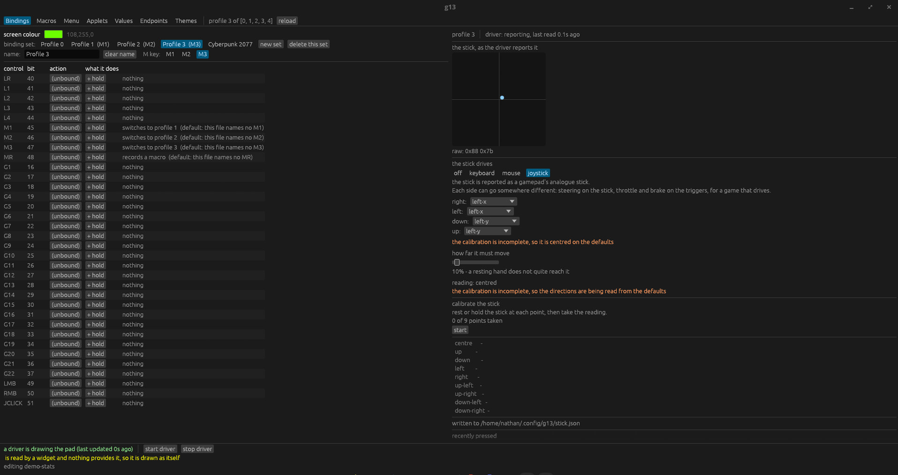
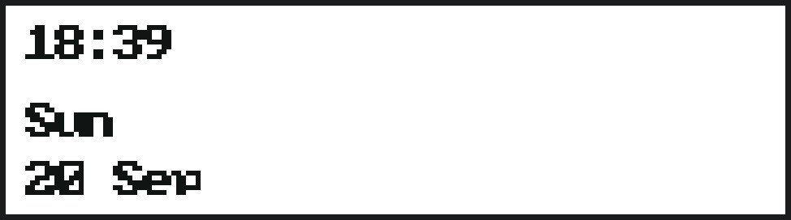

# Getting started

One page, in order. By the end you will have a pad that types, a screen that shows something, and a window you
can change both from.

## 1. Check the install

```bash
g13 doctor
```

It prints one line per thing that matters  -  the programme, the input devices, whether a driver holds the pad,
which service is running, the active profile, and how many binding lines actually apply  -  each marked `ok`,
`note`, `warn` or `fail`, and a `fail` or `warn` line ends with the command that fixes it.

**What to check:** every line you care about says `ok`. If something says `fail`, do what the line says and run
`doctor` again. Nothing else in this document will work if the pad is not being read.

## 2. Start the driver

```bash
g13 run
```

It prints what it is doing: which profile, how many bindings applied, what is on the screen. **Leave it
running.** It holds the pad for as long as it runs, and the pad is not visible to anything else while it does.

**What to check:** the window it prints says a profile and a count of bindings. Then press a key on the pad  -  you
should see the pad's own control name in the driver's output, and the key it sent.

> If your pad already works with the older driver, that one holds the pad instead. Stop it first
> (`systemctl --user stop g13.service`) and start this one; the two cannot both hold the pad, and starting one
> stops the other by design.

## 3. Start the window

In a second terminal:

```bash
g13 gui
```

The window has a tab per subject: **Screen**, **Endpoints**, **Controls**, **Applets**, **Values**, **Macros**,
**Bindings**. Nothing needs a Save button  -  every field writes the moment you change it, and the running driver
picks it up within a second.

**What to check:** the **Values** tab is filling in with live numbers (`cpu`, `memory`, the active profile). If
it is empty, the driver is not running  -  step 2.

## 4. Make a control do something

In the window:

1. **Bindings** tab.
2. Pick the profile you want to change from the list at the top (usually profile 1  -  the picker shows which
   profile is active).
3. Find the control you want, for example `G7`.
4. Click its row, then click **set by pressing**, then press the key on your keyboard that you want that control
   to send.

Or from a terminal:

```bash
g13 record G7
```

and then press the key. `g13 bindings` shows the whole map as the driver is applying it.

**What to check:** press `G7` on the pad. The key you chose should be typed wherever your cursor is  -  try it in a
text editor, so you can see the letters arrive.

The Bindings tab is where it happens: the control on the left, what it sends on the right.



## 5. Put something on the pad's screen

In the window, **Screen** tab. The list on the left is what the driver can show: the built-in `clock`, `system`,
`media` and `pad` screens, and one entry per applet in `~/.config/g13/applets/`.

1. Tick the ones you want in the rotation.
2. Click one to make it the one showing now.
3. If you want it to move between the ticked ones by itself, turn **cycle** on and set the seconds.

From a terminal, the same thing:

```bash
g13 lcd --visual applet:demo-stats
g13 lcd
```

**What to check:** the pad's screen changes as you click, and pressing **LR** (the round button) on the pad
moves to the next of the ticked ones. `g13 lcd` with no arguments prints what is on it now.

|  |  |
|---|---|
|  |  |
| the built-in **clock** | **weather**, an applet with a bitmap for the sky |

## 6. Record a macro on the pad

1. Press **MR** (the button labelled *Macro Record*).
2. Press **M1**, **M2** or **M3** to say which profile the macro belongs to.
3. Press the control you want it on  -  for example **G7**.
4. Type the macro: every key you press is recorded, with its timing.
5. Press **MR** again to finish.

The screen tells you which stage you are in all the way through, and MR's own light stays on while it records.
The last press writes the macro *and* binds it: from then on, `G7` in that profile plays it.

**What to check:** press the control you chose. It should type what you recorded, at the speed you recorded it.
To see it without pressing anything, `g13 macro show <id>` and `g13 macro play <id>`.

[macros.md](macros.md) takes it from there  -  including giving a macro something to decide.

## Where next

- Change what every control does, and the stick: [bindings.md](bindings.md).
- Make a screen of your own: [applets-and-sources.md](applets-and-sources.md).
- Give a macro a decision, or something to do: [macros.md](macros.md).
- Anything not working: [troubleshooting.md](troubleshooting.md).
